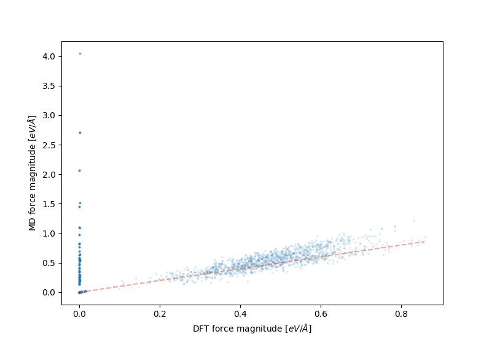

========
Commands
========

-----------------
Merging Databases
-----------------

Everything in DFTFIT is backed by an SQLite3 database. Often times
when running calcluations on supercomputers your calculations will be
stored in several databases. In fact this is recommended because
SQLite3 does not handle concurrency and distributed file systems `well
<https://www.sqlite.org/whentouse.html>`_. ``dftfit db merge`` will
combine several databases into one. It can also de-duplicate
calculations.

.. code-block:: bash

   dftfit db merge database1.db  database2.db -o database.db

---------------------
Evaluating Potentials
---------------------

A challenging area of using potentials for molecular dynamics
calculations is checking that the potential is stable for your
work. DFTFIT makes this easy by taking in a potential plus the ground
state structure. It will predict the:

 - lattice constants
 - elastic constants
 - energy, forces, and stress of configuration

.. code-block:: bash

   dftfit test properties -p test_files/potential/mgo.yaml \
                          -s test_files/structure/MgO.cif

Output::

  Lattice Constants:
        a:  4.199    b:  4.199     c:  4.199
    alpha: 90.000 beta: 90.000 gamma: 90.000

  Elastic:
  Stiffness Tensor
    -313.8   -148.5   -179.1     -0.0     -0.0     -0.0

    -117.1   -333.8   -179.1     -0.0     -0.0     -0.0

    -117.1   -148.6   -353.2     -0.0     -0.0     -0.0

      -0.0     +0.0     -0.0   -120.7     -0.0     +0.0

      -0.0     +0.0     -0.0     -0.0   -120.7     +0.0

      -0.0     -0.0     -0.0     +0.0     -0.0   -120.7

  Shear Modulus G_V -105.36002528878238
  Shear Modulus G_R -106.1332136372622
  Shear Modulus G_vrh -105.74661946302228
  Bulk Modulus K_V -210.04961372048925
  Bulk Modulus K_R -211.15489789675007
  Bulk Modulus K_vrh -210.60225580861965
  Elastic Anisotropy -0.04165984250465549
  Poisons Ration 0.284937698051096

  Static:
      Energy: [eV]
                 -14.559
      Forces: [eV/Angstrom]
                   8.500           20.370           -9.638
                  -8.500          -20.370            9.638
      Stress: [bars]
                 118.599          211.146          -29.249
                 211.146          399.328          -53.051
                 -29.249          -53.051           33.288

DFTFIT will perform the calculation on the input structure so it may
be important to relax it with the potential beforehand.

.. code-block:: bash

   dftfit test relax -p test_files/potential/mgo.yaml \
                     -s test_files/structure/MgO.cif \
                     -o MgO-relaxed.cif

-----------------------
Summarizing DFTFIT runs
-----------------------

After performing many calculations you may want to quickly look
through the database and look at the progress. It will print
interesting features that indicate the success of the optimization.

.. code-block:: bash

   dftfit db summary test_files/database/database.db

Output::

  run: 1
        algo: pygmo.sade       steps:         21
        stats:
              mean:    1.0
              median:  1.0
              min:     1.0
        final:   -1.98,  177, 1.92,  871, 74.6, 1.82e+05, 88.2,  976
        score:   0.9999780011307999

  run: 2
          algo: pygmo.sade       steps:      26248
          stats:
                mean:   0.932
                median: 0.925
                min:    0.86
          final:   -1.31, 0.741, 3.31, 12.8, 0.26, 1.47e+03, 0.404,  640
          score:   0.8522755981712459

  run: 3
          algo: pygmo.sade       steps:      26248
          stats:
                mean:   0.977
                median: 0.973
                min:    0.956
          final:   -1.31, 46.6, 0.143, 20.4, 0.614, 3.67e+03, 0.397,  995
          score:   0.8908135790668292

  run: 4
          algo: pygmo.sade       steps:      98366
          stats:
                mean:   0.795
                median: 0.902
                min:    0.393
          final:   1.77,  163, 0.395,  348, 0.38, 1.88e+03, 0.382,  811
          score:   0.37092898795248247

  run: 5
          algo: pygmo.sade       steps:      26220
          stats:
                mean:   0.909
                median: 0.898
                min:    0.823
          final:   -1.69,  2.5, 96.5, 4.66e+03, 0.229, 1.12e+03, 0.411,  773
          score:   0.7009948887639249

-------------------------
Visualize Progress of Run
-------------------------

The DFTFIT summary command only gives a some information about the
convergence but cannot show the full progress through time. To address
this you can visualize the convergence of a single run.

.. code-block:: shell

   dftfit db progress test_files/database/database.db --run-id=4

.. image:: images/database-run-4-convergence.png

--------------------------------
Training Set Radial Distribution
--------------------------------

One of DFTFIT's main goals is to produce more transferable
potentials. To enable this you can visualize the pair distribution of
each atom combination. The picture below show training from 140
structures close to equilibrium indicated by the sharp peaks.

.. code-block:: shell

   dftfit test radial -t test_files/training/training-full-mgo.yaml

.. image images/mgo-training-set-pair-distribution-201803.png

-----------------------------------------
Visualize Potential Error on Training Set
-----------------------------------------

So far the only indicator for progress was :math:`\Delta E, \Delta F,
\Delta S`. It is not easy to visualize how the potential is fitting
the DFT data. For this DFTFIT provides methods to visualize the error
or the energy, stresses, and forces. Bellow is an example of
visualizing the force error. In this image we can see that the MD
predicted forces tend to be higher than the DFT forces. The red dashed
line indicates a one to one match between the data.

.. code-block:: shell

   dftfit test training forces -p test_files/potential/mgo.yaml \
                               -t test_files/training/training-full-mgo.yaml

------------------------
Visualize Pair Potential
------------------------

Often times complex pair potentials are used in combination with three
body and n body terms. This leads to a complicated pair potential
interaction. This command will visualize the resulting pair potential
from the model for each pair of atoms. This method just does a simple
evaluation of the pair of atoms at different separations in a large
periodic box (much larger than separation).

.. code-block:: shell

   dftfit test pair -p test_files/potential/mgo.yaml

.. image:: images/mgo-pair-potential-energies-201803.png
