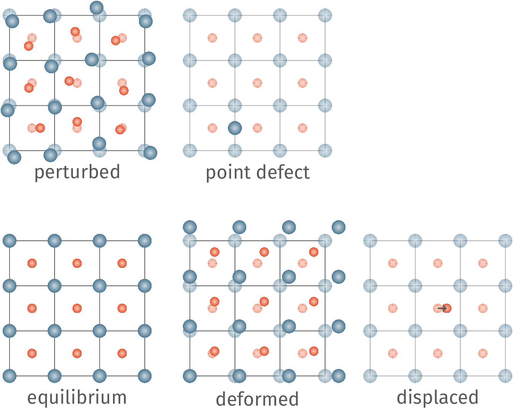

========
Tutorial
========

------------------
Simple MgO Example
------------------

DFTFIT is a software that is used to produce interatomic potentials
for molecular dynamics simulations. The goal of the code is to enable
scientists to use more accurate simulation methods to guide the
construction of these potentials. For this example we will be using
VASP calculations.

The dft training data consists of:

 - equilibrium structure
 - displaced structures :math:`0.01 \unicode{x212B} - 0.04 \unicode{x212B}`
 - deformed structures :math:`\pm\%2` normal, :math:`\pm\%8` shear
 - random perturbed structures :math:`0.04 \unicode{x212B}`

For this example all the training structures are stored in a `cached
database
<https://gitlab.com/costrouc/dftfit/tree/master/examples/mgo/cache/>`_. DFTFIT
uses a cache so that it does not have to reparse all input vasp and
quantum espresso input files. From this cache we get 131 training
structures.

 - 1 equilibrium structure
 - 6 x 10 deformed structures
 - 2 x 5 displaced structures
 - 60 perturbed structures

Now that we have all of our input files we now need to configure our
dftfit potential fitting. We are studing $MgO$ which most commonly
uses a buckingham potential with each atom having a charge.

.. math::

   U_{Mg - Mg} (A_1, \rho_1, C_1) \quad U_{Mg - O} (A_2, \rho_2, C_2) \quad U_{O - O} (A_3, \rho_3, C_3)

   q_{Mg} = -q_{O}

This leads to 10 free parameters.

.. math::

   A_1, \rho_1, C_1, A_2, \rho_2, C_2, A_3, \rho_3, C_3, q_{Mg}

DFTFIT configuration is intentionally separated into 3 parts:
potential, training structures, dftfit configuration. Let us look at
an example potential file. In this case we will be looking at the
`lewis-catlow potential for MgO <https://doi.org/10.1088/0022-3719/18/6/010>`_.

.. code-block::  yaml

   version: v1
   kind: Potential
   spec:
     constraint:
       charge_balance: MgO
     charge:
       Mg: {'initial': 2.0, 'bounds': [1.3, 2]}
       O: {'initial': -2.0, 'bounds': [-2, -1.3]}
     kspace:
       type: pppm
       tollerance: 1e-5
     pair:
       type: buckingham
       cutoff: 10.0
       parameters:
         - elements: ['Mg', 'Mg']
           coefficients:
              - {'initial': 0.1, 'bounds': [1e-6, 1000]}
              - {'initial': 0.1, 'bounds': [1e-6, 1e2]}
              - 0.0
         - elements: ['Mg', 'O']
           coefficients:
              - {'initial': 821.61, 'bounds': [10, 1e4]}
              - {'initial': 0.324199, 'bounds': [1e-6, 1e2]}
              - 0.0
         - elements: ['O', 'O']
           coefficients:
             - {'initial': 22764.915, 'bounds': [1e3, 1e6]}
             - {'initial': 0.14899, 'bounds': [1e-3, 1e2]}
             - {'initial': 20.3705, 'bounds': [1, 1e3]}

Currently DFTFIT supports any float value in the input file to be a
parameter for the optimization. This even means that the buckingham
cutoff radius can be an optimization parameter. Additionally, DFTFIT
has been designed such that it is possible to determine if two
potential parameter files are using the same potential form (I am
quite proud of this feature). It is not perfect but will work for %90
of all cases. The form for a parameter is ``{'initial': <value>,
'bound': [<lower>,<upper>]}``. There is planned support in the future
for spline function parameters. This would be useful for example in
constructing EAM potentials.

Next the training structures need to be defined for input. The current
input file uses calculations generated with my own framework
``mattoolkit`` however vasp and quantum espresso are also supported. The
actual input file in the examples is much longer. We can see that it
is a list of calculations to include. In the case of mattoolkit all
calculations are chosen using a selector. All calculations that match
the labels ``project:potential_fitting``, ``structrue:MgO``,
``calculation_type:static``, ``calculation_group:lattice_constant``. If
you haven't done it already, when you accumulate a lot of data it is
important to assign metadata to all of your calculations. This makes
the calculations much easier to select.

.. code-block:: yaml

   version: v1
   kind: Training
   spec:
     - type: mattoolkit
       selector:
         labels:
           - project:potential_fitting
           - structrue:MgO
           - calculation_type:static
           - calculation_group:lattice_constant

Finally we have the DFTFIT configuration. The configuration is quite
flexible.

.. code-block:: yaml

   version: v1
   kind: Configuration
   metadata:
     name: testing
     labels:
       algorithm: "pygmo.sade"
       test: test
   spec:
     logging: INFO
     database: "/tmp/dftfit/database.db"
     steps: 10
     population: 10
     algorithm:
       name: 'pygmo.sade'
     problem:
       calculator: 'lammps'
       command: 'lammps_serial'
       num_workers: 3
       w_f: 0.3
       w_s: 0.6
       w_e: 0.1
     training:
       cache_filename: "./cache/cache.db"

The ``metadata`` section is for providing information about the
calculation. The ``name`` property needs to be a string. While the
``labels`` are key value pairs that must both be strings. The key value
pairs can be anything. Now we have the parameters that actually affect
the calculation.

logging
  *default is WARNING* it is used to print information during the
  run. Stick with WARNING for a much much cleaner stdout

database
  if specified provide the location for the sqlite3 database

steps
  *required* number of optimization steps

population
  *required* number of potential parameters sets to solve at each iteration

algorithm
  *required* the optimization algorithm to use a good one to start using is SADE. See `pagmo2 algorithmn documentation <https://esa.github.io/pagmo2/docs/algorithm_list.html>`_.

problem.calculator
  molecular dynamics calculator to use lammps is the only one for now

problem.command
  command to run to start calculator *make sure command matches calculator!*

problem.num_workers
  determines the parallelism. Currently DFTFIT doesn't scale well past 8 processors. Each processor does about 150 calculations/second.

w_f, w_s, w_e
  if you have chosen the single objective function it is important to set these properties

training.cache_filename
  where to store the caches parsed training calculations

If is a global optimization algorithm is chosen random population
points will be chosen. After the configuration file has been setup you
are ready to go!  The optimization can be simply run using the
``dftfit`` command installed when installing the python package. Run the
command within the ``examples/mgo`` folder.

.. code-block:: shell

   dftfit train -c configuration.yaml -p potential.yaml -t training.yaml

Since the example configuration only run 10 * 10 = 100 optimization
steps the potential really will not improve. For my calculations I
do 100,000 optimization steps with each step taking less than a
fraction of a second. In total 100,000 steps takes about 10-12
hours.

DFTFIT comes with tools for investigating the results from the
optimization.

TODO add more.
